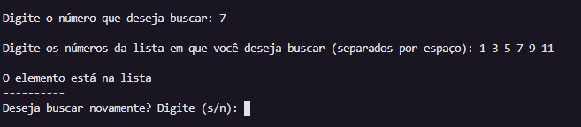
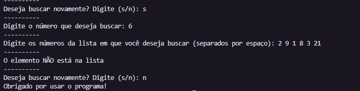

# Como funciona uma busca binária

Para entender de forma prática, imagine que você está procurando a palavra "Programação" em um dicionário: 
Você abre o livro exatamente no meio e vê a letra "M". 
Compara: Como "P" vem depois de "M", você sabe que a palavra não está na primeira metade do dicionário.
Divide e repete: Você descarta a primeira metade e foca apenas na segunda metade. 
Você abre o meio dessa nova parte e repete o processo até encontrar a palavra exata.

# Por que usar a Busca Binária?
*Velocidade extrema:* Em vez de verificar cada elemento um por um (como na busca linear), a busca binária reduz o problema pela metade a cada passo.
*Eficiência matemática:* A complexidade do algoritmo é expressa por \(O(\log n)\). Isso significa que, em uma lista de 1.000.000 de itens, ela precisará de, no máximo, 20 passos para encontrar o que você procura

# Requisito essencial
Para que a busca binária funcione, a lista DEVE estar ordenada (do menor para o maior, ou vice-versa). Se a lista estiver desordenada, será necessário ordená-la antes de aplicar o algoritmo.

O que fazer quando queremos procurar algo dentro de uma lista? Por exemplo, digamos que você queira encontrar certo número dentro de uma lista:

[1, 2, 3, 4, 5, 6, 7, 8, 9, 10]

Só de olhar, podemos dizer se, por exemplo, o número 4 está dentro dessa lista, ou se temos números pares e/ou ímpares, ou se o número 11 está dentro desta lista. 
No entanto, e quando se trata de listas de inúmeros elementos? Para isso, utilizamos a busca binária.


#  Busca Binária em Python

##  Descrição
Este projeto é uma implementação prática do algoritmo de **Busca Binária** em Python. A busca binária é um algoritmo eficiente para encontrar um item em uma lista ordenada de itens. Ela funciona dividindo repetidamente pela metade o intervalo de busca.

##  Pré-requisitos e Instalação
Para executar este projeto, você precisa ter o Python instalado na sua máquina (versão 3.x recomendada).

1. Clone o repositório (após concluirmos a Fase 3):
   ```bash
   git clone https://github.com/DacompMiniCursos/aula-2-github-e-colabora-o-EduReiss.git
```
2. Navegue até a pasta: 
    ```bash
    cd Busca_Binária
```
 
# Como usar:

Para executar o algoritmo, execute o seguinte comando no terminal:
```bash
python busca_binaria.py
```
E então:
1. Digite o número que você deseja buscar e dê ENTER.
2. Digite a lista em que você deseja buscar esse número (Separados por espaço) e dê ENTER.
3. Indique se você deseja realizar outra busca, digitando s ou n e dê ENTER.

# Screenshots
## Execução do programa

## Execução e finalização do programa


# Contribuição
## Deseja melhorar o projeto? Siga os passos: 
1. Faça um **Fork** do repositório
2. Crie um branch para sua feature (`git switch -c feature/sua-melhoria`)
3. Faça seus commits semânticos (`git commit -m "feat: descrição"`)
4. Envie para seu fork (`git push origin feature/sua-melhoria`)
5. Abra um **Pull Request** descrevendo suas mudanças

Obrigado por contribuir com o projeto! 

# Sugestões de contribuição:
1. Adicionar mecanismo para impedir o usuário de inserir outro tipo de input que não seja int nos elementos de número buscado e lista.
2. Fazer controle de erros para que, caso o usuário digitar uma string ou valor não inteiro ou lista no formato incorreto ou outra letra quando perguntado se deseja continuar a buscar, o programa lhe diga como fazer da maneira certa.
3. Introduzir Busca Linear, explicar a diferença entre Busca Linear e Busca Binária


# Autor

Desenvolvido pelo calouro de Ciência da Computação e Inteligência Artificial Eduardo dos Reis Azevedo como parte do minicurso de Git & GitHub do DACOMP UFMA

# Contribuidores:

## Licença

Este projeto está licenciado sob a MIT License - veja o arquivo [LICENSE](LICENSE) para detalhes.

A licença MIT permite:
- ✅ Uso comercial
- ✅ Modificação
- ✅ Distribuição
- ✅ Uso privado

Com a condição de incluir aviso de copyright e licença.

## Histórico:
dc59654 (HEAD -> main) feat: adicionada função de perguntar se o usuário deseja realizar nova busca ou encerrar o programa

aa2c0d3 hotfix: Programa não funciona corretamente ao usuário simplesmente substituir os parâmetros da função pelos valores desejados. Adicionado função input para o usuário adicionar os parâmetros necessários diretamente no terminal.

3bd8635 (origin/main) docs: Correção de erros no README

b0a3932 "Docs: Adição de histórico log no README"

2315460 docs: Correção de alguns erros no README

abeaff9 feat: Adaptação para digitalização do usuário e atualização do README com instruções

080f527 feat: Implementações de controle e últimos testes com o programa


